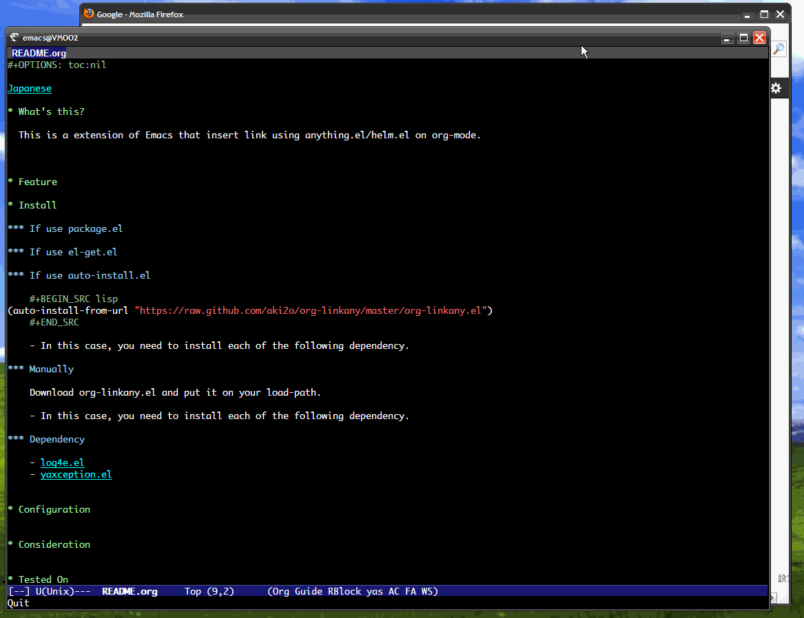

# これは何？

org-modeでのリンク入力にanything.el/helm.elのインタフェースを提供するEmacsの拡張です。

# デモ



# 特徴

### 実際に確認しながら候補選択できる

URLな候補を選択中またはミニバッファ入力中、デフォルトで"C-z"にバインドされている
=persistent-action=を実行するとそのURLをチラ見できます。  

### 対応しているフォーマット形式

現在、以下のリンクフォーマットの入力でanything.el/helm.elによる補完ができます。  
-   http/https/ftp &#x2026; firefox/w3m/hatenaのブックマークを扱うソースから
-   file &#x2026; =find-file=に使われるソースから
-   mailto/bbdb &#x2026; BBDBのレコードから
-   head &#x2026; カレントバッファの見出しから

また、以下の情報も適宜使用されます。

-   org-modeバッファのリンク
-   それ以外のバッファのURLっぽい文字列

# インストール

### package.elを使う場合

2014/03/03 登録申請中

### el-get.elを使う場合

2014/03/03 登録申請中

### auto-install.elを使う場合

```lisp
(auto-install-from-url "https://raw.github.com/aki2o/org-linkany/master/org-linkany.el")
```
-   下記の依存拡張もそれぞれインストールする必要があります

### 手動の場合

org-linkany.elをダウンロードし、load-pathの通った場所に配置して下さい。
-   下記の依存拡張もそれぞれインストールする必要があります

### 依存拡張

-   
-   

# 設定

```lisp
(require 'org-linkany)

;; Make config suit for you. About the config item, eval the following sexp.
;; (customize-group "org-linkany")
```

# 留意事項

### org-linkany/url-source-collection

この変数は、URLフォーマットのリンク入力で使われます。  
デフォルトでは、firefox、w3m、はてなのブックマークのソースが設定されていますが、  
それらが使えるようになっていない場合、=anything=/=helm=の実行でエラーになってしまうかも知れません。  
その場合には、ご自分の環境に合わせて、この変数を適宜設定して下さい。  

### org-linkany/browse-function

この変数に設定された関数は、=persistent-action=で実行されます。  
デフォルトは、=browse-url-firefox=にしていますが、OSやEmacsのバージョンによっては
上手く動作しないことがあると思います。  
その場合には、ご自分の環境に合わせて、この変数を適宜設定して下さい。  

# 動作確認

-   Emacs &#x2026; GNU Emacs 24.2.1 (i386-mingw-nt5.1.2600) of 2012-12-08 on GNUPACK
-   log4e.el &#x2026; 0.2.0
-   yaxception.el &#x2026; 0.1

**Enjoy!!!**
